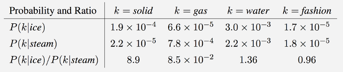
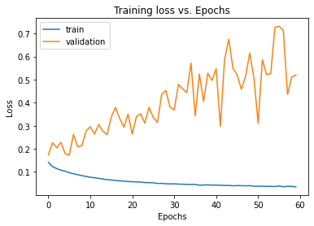
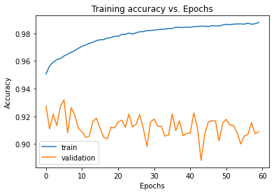

# Hate Speech Detection using NLP

Hate speech using a CNN based model with Glove embedding layer (transfer learning). The dataset contains of toxic comments from various online social media platforms.

## Data Visualisation & Preprocessing

The dataset was divided into two parts, a training set and a test set.

The training set contains of 159571 comments each labelled as either toxic('1') or non-toxic('0').
Here's a preview:

        toxic                                               text
0           0  Explanation\r\nWhy the edits made under my use...
1           0  D'aww! He matches this background colour I'm s...
2           0  Hey man, I'm really not trying to edit war. It...
3           0  "\r\nMore\r\nI can't make any real suggestions...
4           0  You, sir, are my hero. Any chance you remember...
...       ...                                                ...
159566      0  ":::::And for the second time of asking, when ...
159567      0  You should be ashamed of yourself \r\n\r\nThat...
159568      0  Spitzer \r\n\r\nUmm, theres no actual article ...
159569      0  And it looks like it was actually you who put ...
159570      0  "\r\nAnd ... I really don't think you understa...

[159571 rows x 2 columns]

The test set contains of 63978 comments in a labelled similarly.
Here's a preview:

       toxic                                               text
0          0  Thank you for understanding. I think very high...
1          0                   :Dear god this site is horrible.
2          0  "::: Somebody will invariably try to add Relig...
3          0  " \r\n\r\n It says it right there that it IS a...
4          0  " \r\n\r\n == Before adding a new product to t...
...      ...                                                ...
63973      0  :Jerome, I see you never got around to this…! ...
63974      0  ==Lucky bastard== \r\n http://wikimediafoundat...
63975      0  ==shame on you all!!!== \r\n\r\n You want to s...
63976      1  MEL GIBSON IS A NAZI BITCH WHO MAKES SHITTY MO...
63977      0  " \r\n\r\n == Unicorn lair discovery == \r\n\r...

[63978 rows x 2 columns]

## Preprocessing and text cleaning

Before processing our comments, we will first clean them so that the model can process them as efficiently as possible.
For this purpose, we remove punctuations, stopwords, URL's, html and other symbols that don't contribute to the sentiment of the sentences.

After preprocessing, the dataset:

|       | toxic |                                              text|
|-------|-------|--------------------------------------------------|
|0      |     0 | explanation edits made username hardcore metal...|
|1      |     0 | d'aww! matches background colour i'm seemingly...|
|2      |     0 | hey man, i'm really trying edit war. guy const...|
|3      |     0 | can't make real suggestions improvement wonder...|
|4      |     0 |   you, sir, hero. chance remember page that's on?|
|...    |   ... |                                               ...|
|159566 |     0 | ":::::and second time asking, view completely ...|
|159567 |     0 | ashamed horrible thing put talk page. 128.61.1...|
|159568 |     0 | spitzer umm, theres actual article prostitutio...|
|159569 |     0 | looks like actually put speedy first version d...|
|159570 |     0 | ... really think understand. came idea bad rig...|

[159571 rows x 2 columns]

## Model

The model uses GloVe embedding (transfer learning) and several convolution and poolinglayers, binary crossentropy loss function and adam optimizer.

# GloVe Embedding

GloVe is essentially a log-bilinear model with a weighted least-squares objective. The main intuition underlying the model is the simple observation that ratios of word-word co-occurrence probabilities have the potential for encoding some form of meaning. For example, consider the co-occurrence probabilities for target words ice and steam with various probe words from the vocabulary.

_

As one might expect, ice co-occurs more frequently with solid than it does with gas, whereas steam co-occurs more frequently with gas than it does with solid. Both words co-occur with their shared property water frequently, and both co-occur with the unrelated word fashion infrequently. In this way, the ratio of probabilities encodes some crude form of meaning associated with the abstract concept of thermodynamic phase. 

The GloVe embedding layer produces vector representation of words which are further processed through the model to extract the overall sentiment of the comments and classify them as toxic.

#Strcuture:

Model: "sequential"
|Layer (type)                | Output Shape        |      Param #   |
|----------------------------|---------------------|----------------|
|embedding (Embedding)       | (None, 300, 100)    |      1000000   |
|dropout (Dropout)           | (None, 300, 100)    |      0         |
|conv1d (Conv1D)             | (None, 298, 250)    |      75250     |
|max_pooling1d (MaxPooling1D)| (None, 149, 250)    |      0         |
|conv1d_1 (Conv1D)           | (None, 145, 250)    |      312750    |
|global_max_pooling1d(Global)| (None, 250)         |      0         |
|dense (Dense)               | (None, 250)         |      62750     |
|dropout_1 (Dropout)         | (None, 250)         |      0         |
|dense_1 (Dense)             | (None, 1)           |      251       |

Total params: 1,451,001
Trainable params: 451,001
Non-trainable params: 1,000,000
___________________________________________________________________

## Results

Accuracy: 92.89%
F1 Score: 0.8091

